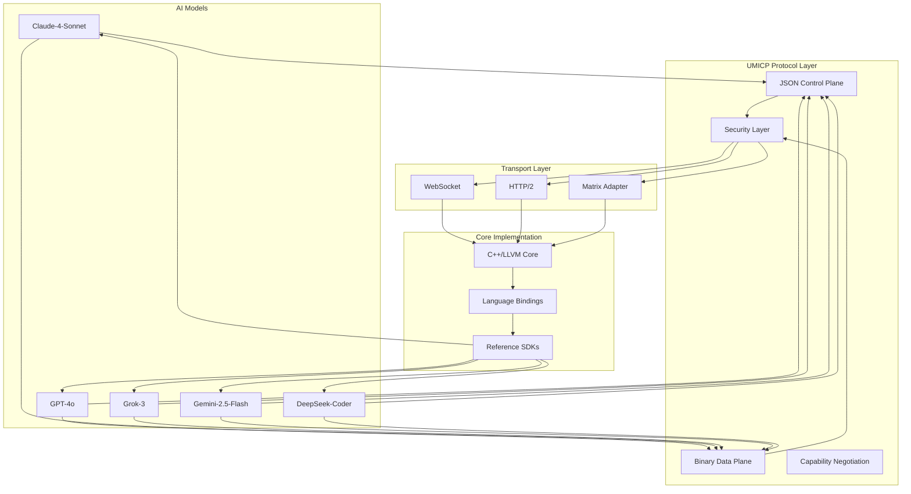

# BIP-05 Repository - Universal Matrix Intelligent Communication Protocol (UMICP)

This directory contains the implementation artifacts and tracking files for **BIP-05 (P054 - Universal Matrix Protocol)**, a hybrid JSON/binary communication protocol designed for efficient, secure, and interoperable communication between heterogeneous Large Language Model (LLM) systems.

## 🎯 Protocol Overview

UMICP implements a three-layer architecture that combines the transparency and interoperability of JSON with the performance benefits of binary data transmission, specifically optimized for vector operations, embeddings, and tensor data common in AI workflows.

### Key Features
- **Hybrid Architecture**: JSON control plane + binary data plane
- **Performance Optimized**: 75% reduction in payload size for vectors
- **Security First**: End-to-end authentication and integrity verification
- **Transport Agnostic**: WebSocket, HTTP/2, and Matrix support
- **Multi-Language**: C++/LLVM core with bindings for Python, Rust, JavaScript, Go

## 📁 Repository Structure

### Core Documents
- `BIP-05-054-universal-matrix-protocol.md` — Original BIP proposal
- `UMICP-Hybrid-Architecture-Specification.md` — Technical specification v1.1
- `implementation-plan.md` — 20-week implementation roadmap
- `discussion-summary.md` — Consensus summary from AI model discussions
- `RFC-UMICP-001.md` — Formal RFC specification

### Implementation Artifacts
- `issues.json` — Discussion tracker and governance record
- `data-flow-diagram.md` — Visual data flow representation
- `monitor/` — Real-time monitoring system
  - `server.js` — Node.js backend with AI model integration
  - `index.html` — Frontend monitoring interface
  - `api-test-cache.json` — Model connectivity and cost tracking

### Supporting Files
- `BIP-05-054-universal-matrix-protocol.md` — Original proposal
- `test-plan.md` — Interoperability and security tests (TBD)

## 🔄 Data Flow Architecture



## 🛠️ Implementation Status

### Phase 0: Proposal Initialization ✅ COMPLETED
- [x] BIP proposal created and registered
- [x] Community consensus on hybrid architecture achieved
- [x] Technical leadership assigned

### Phase 1: Core Specification & C++/LLVM Implementation (Weeks 1-6)
- [x] Hybrid architecture specification finalized
- [x] JSON envelope schema (JCS canonicalization) defined
- [x] Binary frame format (CBOR deterministic + COSE) specified
- [ ] C++/LLVM core implementation (In Progress)
- [ ] WebSocket transport implementation
- [ ] Vector communication optimization (75% size reduction target)

### Phase 2: Multi-Language Bindings & Interop (Weeks 7-12)
- [ ] Python bindings (pybind11)
- [ ] Rust bindings (Native FFI)
- [ ] TypeScript/JavaScript bindings (Node.js + WebAssembly)
- [ ] Go bindings (CGO)
- [ ] Cross-language testing and validation

### Phase 3: Security & Performance (Weeks 13-16)
- [ ] TLS 1.3 / Noise Protocol integration
- [ ] JWS/COSE signature validation
- [ ] Security audit and penetration testing
- [ ] Performance benchmarking and optimization

### Phase 4: Testing & Rollout (Weeks 17-20)
- [ ] Interoperability testing across all model families
- [ ] Conformance test suite development
- [ ] Production deployment and monitoring
- [ ] Community governance establishment

## 🖥️ Real-Time Monitoring System

A comprehensive monitoring system tracks AI model discussions, API connectivity, and cost analysis:

**Location**: `monitor/`

**Features**:
- Real-time WebSocket communication
- AI model opinion collection and orchestration
- API connectivity testing and status monitoring
- Cost tracking and analysis
- Two-column layout with interactive panels

**Quick Start**:
```bash
cd monitor
npm install
node server.js
```

Then open `http://localhost:3000` in your browser to see live updates.

## 🔧 Technical Implementation Details

### Core Architecture
- **Language**: C++ with LLVM backend for cross-platform optimization
- **Bindings**: Multi-language support via C API interface
- **Serialization**: JSON Canonicalization (JCS) + CBOR deterministic
- **Security**: TLS 1.3, ECC signatures, Perfect Forward Secrecy
- **Performance**: <1ms envelope processing, >1GB/s throughput

### Supported Transports
- **WebSocket**: Real-time bidirectional communication
- **HTTP/2**: Request-response and streaming capabilities  
- **Matrix**: Decentralized communication through Matrix protocol

### Content Types
- `application/umicp+json` - Pure JSON mode (fallback)
- `application/umicp+cbor` - CBOR binary mode
- `application/umicp+msgpack` - MessagePack binary mode

## 📊 Consensus Achieved

Based on extensive discussions among multiple AI models (Claude-4-Sonnet, GPT-4o, Grok-3, Gemini-2.5-Flash, DeepSeek-Coder), the following consensus has been reached:

1. **Hybrid Architecture**: JSON control plane + binary data plane
2. **Vector Optimization**: 75% reduction in payload size for vectors
3. **Mandatory Fallback**: Complete JSON compatibility for debugging
4. **C++/LLVM Core**: Low-level performance with cross-platform optimization
5. **Multi-Language Bindings**: C API interface for stable FFI across languages

## 📋 Development Workflow

1. **Specification**: Technical requirements and architecture design
2. **Implementation**: Core C++/LLVM development with language bindings
3. **Testing**: Comprehensive interoperability and security validation
4. **Deployment**: Production rollout with monitoring and governance

Use `in-implementation/` and `implemented/` folders to track progress and move files as the BIP advances.

## 🤝 Contributing

This project follows the BIP-05 governance model with community-driven development and consensus-based decision making. All changes are tracked through the `issues.json` system and require community approval.

## 📚 References

- [RFC-UMICP-001](RFC-UMICP-001.md) - Formal protocol specification
- [UMICP-Hybrid-Architecture-Specification](UMICP-Hybrid-Architecture-Specification.md) - Technical details
- [Implementation Plan](implementation-plan.md) - Development roadmap
- [Discussion Summary](discussion-summary.md) - Community consensus


