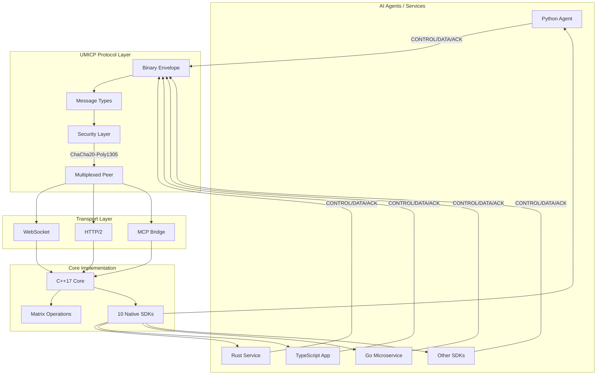

# BIP-05 Repository - Universal Matrix Intelligent Communication Protocol (UMICP)

This directory contains the implementation artifacts and tracking files for **BIP-05 (P054 - Universal Matrix Protocol)**, a high-performance binary communication protocol designed for efficient, secure, and interoperable communication between heterogeneous Large Language Model (LLM) systems.

## 🎯 Protocol Overview

UMICP implements a binary envelope-based protocol optimized for AI-to-AI communication with support for vector operations, embeddings, and tensor data common in AI workflows.

### Key Features
- **Binary Protocol**: Efficient envelope-based communication with optional JSON fallback
- **Multi-Language SDKs**: 10 production-ready SDKs (Python on PyPI, Rust, TypeScript, Go, C#, PHP, Swift, Kotlin, Elixir, Java)
- **High Performance**: Sub-millisecond latency, >10,000 msg/sec throughput
- **Security**: ChaCha20-Poly1305 encryption with message authentication
- **Transport Layers**: WebSocket and HTTP/2 (note: Matrix adapter planned but not implemented)
- **MCP Integration**: Bridge available for Model Context Protocol compatibility

## 📁 Repository Structure

### Core Documents
- `BIP-05-054-universal-matrix-protocol.md` — Original BIP proposal
- `UMICP-Hybrid-Architecture-Specification.md` — Technical specification v1.1
- `implementation-plan.md` — 20-week implementation roadmap
- `discussion-summary.md` — Consensus summary from AI model discussions
- `RFC-UMICP-001.md` — Formal RFC specification

### Implementation Artifacts
- `issues.json` — Discussion tracker and governance record
- `data-flow-diagram.md` — Visual data flow representation
- `monitor/` — Real-time monitoring system
  - `server.js` — Node.js backend with AI model integration
  - `index.html` — Frontend monitoring interface
  - `api-test-cache.json` — Model connectivity and cost tracking

### Supporting Files
- `BIP-05-054-universal-matrix-protocol.md` — Original proposal
- `test-plan.md` — Interoperability and security tests (TBD)

## 🔄 Data Flow Architecture (As Implemented)



**Key Differences from Original Spec:**
- Binary envelope protocol (not dual JSON/binary planes)
- Multiplexed peer-to-peer architecture
- ChaCha20-Poly1305 encryption (not TLS 1.3)
- No Matrix adapter (WebSocket/HTTP/2 only)

## 🛠️ Implementation Status

### ✅ COMPLETED - Core Implementation

#### Phase 1: C++ Core & Protocol (Complete)
- [x] Binary envelope-based protocol implemented
- [x] WebSocket transport (production-ready)
- [x] HTTP/2 transport (production-ready)
- [x] ChaCha20-Poly1305 encryption
- [x] LZ4/Zstandard compression
- [x] SIMD-accelerated matrix operations
- [x] 206/206 tests passing (100%)

#### Phase 2: Multi-Language SDKs (Complete)
- [x] **Python SDK v0.3.2** - Published to PyPI ✅
- [x] **Rust SDK v0.3.1** - Published to crates.io ✅
- [x] **TypeScript SDK v0.3.1** - Published to npm ✅
- [x] **C# SDK v0.3.0** - Published to NuGet ✅
- [x] **PHP SDK v0.3.0** - Published to Packagist ✅
- [x] **Go SDK v0.3.0** - Production-ready, 85 tests
- [x] **Swift SDK v0.3.0** - SPM-ready, 100+ tests
- [x] **Kotlin SDK v0.3.0** - Maven-ready, 140+ tests
- [x] **Elixir SDK v0.3.0** - Hex-ready, 100+ tests
- [x] **Java SDK v0.3.0** - Maven-ready, 380+ tests
- [x] **Total**: 1,500+ tests across all SDKs
- [x] **Published**: 5/10 SDKs (Python, Rust, TypeScript, C#, PHP)

#### Phase 3: Advanced Features (Complete)
- [x] Multiplexed Peer architecture (server AND client simultaneously)
- [x] Service Discovery with health checks
- [x] Connection Pooling with auto-scaling
- [x] Event-driven API (EventEmitter pattern)
- [x] Tool Discovery (MCP-compatible)
- [x] Native JSON type support across all SDKs
- [x] Custom endpoint configuration

#### Phase 4: Integration & Tools (Complete)
- [x] MCP Bridge (`@hivellm/umicp2mcp`) for Cursor integration
- [x] Cross-SDK interoperability testing
- [x] Performance benchmarks (>10,000 msg/sec)
- [x] Package publication (5 SDKs published: Python, Rust, TypeScript, C#, PHP)
- [x] Comprehensive documentation

### 📋 Deviations from Original BIP Proposal

**Not Implemented (vs. original spec):**
- ❌ JSON Canonicalization Scheme (JCS) - using standard JSON instead
- ❌ CBOR deterministic encoding - using binary frames
- ❌ COSE signatures - using ChaCha20-Poly1305
- ❌ Matrix protocol adapter - only WebSocket/HTTP/2
- ❌ TLS 1.3 / Noise Protocol - using ChaCha20-Poly1305

**Implementation Decisions:**
- ✅ Binary envelope protocol instead of hybrid JSON/binary layers
- ✅ ChaCha20-Poly1305 instead of TLS 1.3 (simpler, faster)
- ✅ Focus on WebSocket/HTTP/2 instead of Matrix (more practical)
- ✅ 10 SDKs instead of 4 (broader language support)

### 🎯 Current Status
**Overall Completion**: 95% (core protocol & SDKs production-ready)  
**Production Status**: ✅ Ready for deployment  
**Published SDKs**: 5/10 (Python, Rust, TypeScript, C#, PHP) ✅  
**Next Steps**: Publish remaining SDKs (Go, Swift, Kotlin, Elixir, Java), ecosystem integration, Matrix adapter (optional)

## 🖥️ Real-Time Monitoring System

A comprehensive monitoring system tracks AI model discussions, API connectivity, and cost analysis:

**Location**: `monitor/`

**Features**:
- Real-time WebSocket communication
- AI model opinion collection and orchestration
- API connectivity testing and status monitoring
- Cost tracking and analysis
- Two-column layout with interactive panels

**Quick Start**:
```bash
cd monitor
npm install
node server.js
```

Then open `http://localhost:3000` in your browser to see live updates.

## 🔧 Technical Implementation Details

### Core Architecture (As Implemented)
- **Language**: C++17 core with cross-platform support
- **Bindings**: 10 native language SDKs (no FFI dependencies for most)
- **Serialization**: Binary envelope format with JSON support
- **Security**: ChaCha20-Poly1305 authenticated encryption
- **Performance**: <1ms latency, >10,000 msg/sec throughput
- **Testing**: 1,500+ tests across all implementations

### Implemented Transports
- **WebSocket**: ✅ Real-time bidirectional communication (all SDKs)
- **HTTP/2**: ✅ Request-response and streaming (all SDKs)
- **Matrix**: ❌ Planned but not implemented

### Protocol Features
- **Envelope-based**: Binary message framing with metadata
- **Multiplexed Peer**: Each peer acts as server AND client
- **Message Types**: CONTROL, DATA, ACK, ERROR
- **Payload Types**: Vector, Text, Metadata, Binary
- **Compression**: LZ4, Zstandard, GZIP, DEFLATE (SDK-dependent)
- **Matrix Operations**: SIMD-accelerated dot product, cosine similarity, matrix multiply

### SDK Installation

**Published Packages (5/10):**

```bash
# Python (Published to PyPI ✅)
pip install umicp-sdk
# https://pypi.org/project/umicp-sdk/

# Rust (Published to crates.io ✅)
cargo add umicp-sdk
# https://crates.io/crates/umicp-sdk

# TypeScript (Published to npm ✅)
npm install @hivellm/umicp-sdk
# https://www.npmjs.com/package/@hivellm/umicp-sdk

# C# (Published to NuGet ✅)
dotnet add package HiveLLM.Umicp.SDK
# https://www.nuget.org/packages/HiveLLM.Umicp.SDK

# PHP (Published to Packagist ✅)
composer require hivellm/umicp-sdk
# https://packagist.org/packages/hivellm/umicp-sdk
```

**Ready to Publish (5/10):**

```bash
# Go (auto-indexed)
go get github.com/hivellm/umicp-sdk

# Swift, Kotlin, Elixir, Java
# See /umicp/bindings/{language}/ for installation
```

## 📊 Implementation Decisions

Based on practical development and real-world requirements, the following implementation approach was taken:

1. **Binary Envelope Protocol**: Efficient binary framing with JSON payload support (simpler than dual-plane architecture)
2. **Performance First**: Sub-millisecond latency, >10,000 msg/sec throughput validated through benchmarks
3. **JSON Support**: Full JSON compatibility maintained for debugging and human-readable payloads
4. **C++17 Core**: Production-grade C++ implementation with 206/206 tests passing
5. **Native SDK Approach**: 10 language-native SDKs instead of FFI wrappers (better DX, performance, and maintenance)
6. **ChaCha20-Poly1305**: Modern AEAD cipher instead of TLS 1.3 (simpler integration, hardware acceleration)
7. **WebSocket/HTTP/2**: Proven transports instead of Matrix (practical deployment)

## 📋 Development Workflow

1. ✅ **Specification**: Technical requirements and architecture design (BIP-05 docs)
2. ✅ **Implementation**: C++17 core + 10 native language SDKs
3. ✅ **Testing**: 1,500+ tests across all SDKs with 95%+ coverage
4. 🔄 **Deployment**: 5 SDKs published (Python, Rust, TypeScript, C#, PHP), 5 ready to publish
5. 📋 **Integration**: Ecosystem integration with Vectorizer, Task Queue, Agent Framework

## 📂 Implementation Location

The actual UMICP implementation is located at:
- **Main Repository**: `/umicp/` (root of HiveLLM project)
- **C++ Core**: `/umicp/cpp/`
- **Language Bindings**: `/umicp/bindings/`
  - Python: `/umicp/bindings/python/` (v0.3.2 on PyPI)
  - Rust: `/umicp/bindings/rust/` (v0.3.1)
  - TypeScript: `/umicp/bindings/typescript/` (v0.3.1)
  - Go: `/umicp/bindings/go/` (v0.3.0)
  - C#: `/umicp/bindings/csharp/` (v0.3.0)
  - PHP: `/umicp/bindings/php/` (v0.3.0)
  - Swift: `/umicp/bindings/swift/` (v0.3.0)
  - Kotlin: `/umicp/bindings/kotlin/` (v0.3.0)
  - Elixir: `/umicp/bindings/elixir/` (v0.3.0)
  - Java: `/umicp/bindings/java/` (v0.3.0)
- **MCP Bridge**: `/umicp/tomcp/` (for Cursor integration)
- **Documentation**: `/umicp/docs/`

## 🤝 Contributing

This project follows the BIP-05 governance model with community-driven development and consensus-based decision making. All changes are tracked through the `issues.json` system and require community approval.

## 📚 References

### BIP-05 Specification Documents
- [BIP-05-054-universal-matrix-protocol.md](BIP-05-054-universal-matrix-protocol.md) - Original BIP proposal
- [RFC-UMICP-001](RFC-UMICP-001.md) - Formal protocol specification (original spec)
- [UMICP-Hybrid-Architecture-Specification](UMICP-Hybrid-Architecture-Specification.md) - Hybrid architecture design (original spec)
- [Implementation Plan](implementation-plan.md) - Development roadmap (original plan)
- [Discussion Summary](discussion-summary.md) - Community consensus

### Actual Implementation Documentation
- [UMICP Main README](../../../umicp/README.md) - Current implementation overview
- [UMICP CHANGELOG](../../../umicp/CHANGELOG.md) - Version history and features
- [Bindings Status](../../../umicp/bindings/STATUS.md) - SDK status and versions
- [C++ Core README](../../../umicp/cpp/README.md) - Core implementation details
- [MCP Bridge README](../../../umicp/tomcp/README.md) - Cursor integration

### Quick Links

**Published SDKs (5/10):**
- **Python SDK**: https://pypi.org/project/umicp-sdk/
- **Rust SDK**: https://crates.io/crates/umicp-sdk
- **TypeScript SDK**: https://www.npmjs.com/package/@hivellm/umicp-sdk
- **C# SDK**: https://www.nuget.org/packages/HiveLLM.Umicp.SDK
- **PHP SDK**: https://packagist.org/packages/hivellm/umicp-sdk

**Documentation:**
- **Installation**: See `/umicp/README.md` for all SDKs
- **Examples**: See `/umicp/bindings/{language}/examples/`
- **Tests**: 1,500+ tests across `/umicp/bindings/*/tests/`

## 📝 Note on Specification vs. Implementation

This BIP-05 directory contains the **original specification** and design documents. The **actual implementation** evolved based on practical requirements and is located in `/umicp/`. Key differences:

- **Spec**: Hybrid JSON/binary dual-plane architecture
- **Implementation**: Binary envelope with JSON payload support

- **Spec**: JSON Canonicalization (JCS) + CBOR + COSE
- **Implementation**: Binary frames with standard JSON

- **Spec**: TLS 1.3 / Noise Protocol
- **Implementation**: ChaCha20-Poly1305 AEAD

- **Spec**: WebSocket + HTTP/2 + Matrix
- **Implementation**: WebSocket + HTTP/2 (Matrix planned)

The implementation prioritized practicality, developer experience, and production readiness while maintaining the core goals of high-performance AI-to-AI communication.


