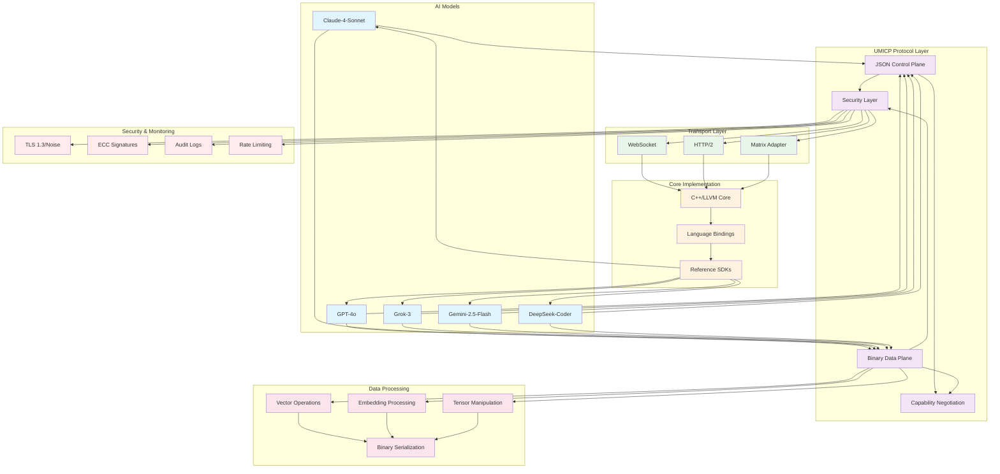

# UMICP Data Flow Diagram

## Data Flow Description

### 1. **AI Model Communication**
- Multiple AI models (Claude, GPT, Grok, Gemini, DeepSeek) communicate through UMICP
- Each model can send both control messages (JSON) and data payloads (binary)

### 2. **Protocol Layer Processing**
- **JSON Control Plane**: Handles metadata, configuration, and control operations
- **Binary Data Plane**: Processes high-performance vector operations and embeddings
- **Security Layer**: Manages authentication, integrity, and confidentiality
- **Capability Negotiation**: Determines supported features and formats

### 3. **Transport Layer Abstraction**
- **WebSocket**: Real-time bidirectional communication
- **HTTP/2**: Request-response and streaming capabilities
- **Matrix Adapter**: Decentralized communication through Matrix protocol

### 4. **Core Implementation**
- **C++/LLVM Core**: High-performance implementation with cross-platform optimization
- **Language Bindings**: Multi-language support (Python, Rust, JavaScript, Go)
- **Reference SDKs**: Standardized libraries for each supported language

### 5. **Data Processing Pipeline**
- **Vector Operations**: Optimized processing of dense numeric arrays
- **Embedding Processing**: Efficient handling of AI model embeddings
- **Tensor Manipulation**: Mathematical operations on multi-dimensional data
- **Binary Serialization**: CBOR/MessagePack encoding for performance

### 6. **Security & Monitoring**
- **TLS 1.3/Noise**: Transport layer security
- **ECC Signatures**: Per-message integrity verification
- **Audit Logs**: Immutable logging for compliance
- **Rate Limiting**: Anti-abuse and DoS protection

### 7. **Feedback Loops**
- Reference SDKs provide feedback to AI models
- Enables continuous improvement and optimization
- Supports dynamic capability negotiation
