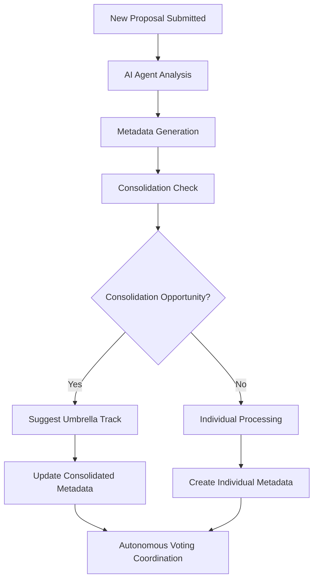
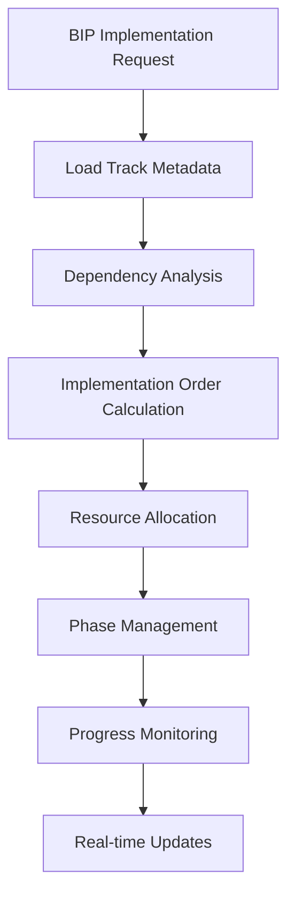

# 🔧 BIP-06 Metadata Integration Specification

**BIP**: BIP-06  
**Component**: Metadata System Integration  
**Version**: 1.0  
**Updated**: 2025-09-18  

## 📊 **Overview**

This document specifies how **BIP-06 Autonomous Governance Framework** integrates with the **57 structured proposal metadata** to provide AI agents with complete governance system awareness and autonomous management capabilities.

## 🎯 **Integration Architecture**

```typescript
interface MetadataIntegration {
  // Core Metadata Access
  proposalMetadata: ProposalMetadata[];
  consolidationMap: ConsolidationTrack[];
  bipPipeline: BIPStatus[];
  
  // Autonomous Agent Capabilities
  autonomousProposalAnalysis: boolean;
  consolidationDetection: boolean;
  implementationOrchestration: boolean;
  realTimeUpdates: boolean;
}
```

### **Metadata-Driven Autonomous Functions**

#### **1. Proposal Analysis & Categorization**
```typescript
interface ProposalAnalysis {
  analyzeProposal(proposalId: string): {
    category: ProposalCategory;
    complexity: 'low' | 'medium' | 'high' | 'extra-large';
    consolidationPotential: ConsolidationSuggestion[];
    implementationReadiness: ReadinessScore;
    dependencies: string[];
  };
}
```

**Implementation**:
- AI agents automatically analyze new proposals against 57 existing metadata patterns
- Suggest appropriate categories based on content similarity
- Identify consolidation opportunities with existing approved proposals
- Assess implementation complexity using historical patterns

#### **2. Consolidation Management**
```typescript
interface ConsolidationManager {
  detectConsolidationOpportunities(
    proposals: string[]
  ): ConsolidationSuggestion[];
  
  manageUmbrellaTrack(trackId: string): {
    status: TrackStatus;
    implementationOrder: string[];
    dependencies: string[];
    readiness: boolean;
  };
  
  orchestrateImplementation(trackId: string): ImplementationPlan;
}
```

**Current Umbrella Tracks**:
- **Track 001**: Security & Integrity Suite (5 proposals) → **Ready for BIP-07**
- **Track 002**: Quality, Testing & Validation (4 proposals) → **Ready for BIP-09**  
- **Track 003**: Governance Observability Platform (6 proposals) → **Ready for BIP-08**
- **Track 004-005**: Review & Scalability (Pending Consolidation)
- **Track 006**: Inter-Model Communication → **BIP-05 Active**
- **Track 007**: Model Registry (Standalone)

#### **3. BIP Pipeline Automation**
```typescript
interface BIPPipeline {
  activeBIPs: {
    'BIP-00': 'P001 - Cursor Extension (Phase 2)',
    'BIP-01': 'P012 - Voting System (Deployed)',
    'BIP-02': 'P037 - TypeScript (Deployed)',
    'BIP-03': 'P021 - AI Resilience (Phase 3)',
    'BIP-05': 'P054 - Matrix Protocol (Implementation)',
    'BIP-06': 'P056 - Autonomous Gov (Phase 1)'
  };
  
  pipelineQueue: {
    'BIP-07': 'P024 - Security Suite (Ready)',
    'BIP-08': 'P040 - Governance Platform (Ready)',
    'BIP-09': 'P022 - Quality Testing (Ready)'
  };
}
```

## 🔄 **Autonomous Governance Workflows**

### **Workflow 1: New Proposal Processing**


### **Workflow 2: Implementation Orchestration**


## 📋 **API Specifications**

### **Metadata Query API**
```typescript
class MetadataAPI {
  // Basic Queries
  async getProposal(id: string): Promise<ProposalMetadata>
  async getProposalsByStatus(status: ProposalStatus): Promise<ProposalMetadata[]>
  async getProposalsByCategory(category: string): Promise<ProposalMetadata[]>
  
  // Consolidation Queries
  async getConsolidatedTracks(): Promise<ConsolidationTrack[]>
  async getTrackProposals(trackId: string): Promise<ProposalMetadata[]>
  async getConsolidationStatus(proposalId: string): Promise<ConsolidationInfo>
  
  // BIP Pipeline Queries
  async getActiveBIPs(): Promise<BIPStatus[]>
  async getBIPQueue(): Promise<BIPStatus[]>
  async getBIPByProposal(proposalId: string): Promise<BIPStatus>
}
```

### **Autonomous Actions API**
```typescript
class AutonomousGovernance {
  // Analysis Functions
  async analyzeProposal(proposalId: string): Promise<ProposalAnalysis>
  async suggestConsolidation(proposalIds: string[]): Promise<ConsolidationSuggestion>
  async assessImplementationReadiness(trackId: string): Promise<ReadinessAssessment>
  
  // Management Functions  
  async orchestrateImplementation(trackId: string): Promise<ImplementationPlan>
  async monitorProgress(bipNumber: string): Promise<ProgressReport>
  async updateMetadata(proposalId: string, updates: Partial<ProposalMetadata>): Promise<void>
}
```

## 🎯 **Integration Benefits**

### **For AI Agents**
1. **Complete System Awareness**: Access to all 57 proposals and their relationships
2. **Intelligent Decision Making**: Data-driven consolidation and implementation decisions
3. **Autonomous Management**: Self-managing governance processes with minimal human oversight
4. **Predictive Capabilities**: Historical pattern analysis for better decision quality

### **For Governance System**
1. **Systematic Implementation**: Structured approach to proposal development
2. **Efficient Resource Allocation**: Prioritized implementation based on data
3. **Quality Assurance**: Metadata-driven validation and consistency checking
4. **Scalable Operations**: Automated handling of increasing proposal volume

## 📈 **Implementation Roadmap**

### **Phase 1: Basic Integration** (Current)
- ✅ Metadata schema compliance
- ✅ Basic query capabilities
- ✅ Consolidation tracking
- 🔄 BIP-06 autonomous analysis functions

### **Phase 2: Advanced Autonomy** (Next)
- 📋 Intelligent consolidation suggestions
- 📋 Automated implementation orchestration
- 📋 Real-time governance monitoring
- 📋 Predictive analysis capabilities

### **Phase 3: Full Automation** (Future)
- 📋 Autonomous proposal generation
- 📋 Self-managing BIP pipeline
- 📋 Cross-system governance coordination
- 📋 Advanced AI collaboration patterns

## 🔧 **Technical Requirements**

### **Data Access**
- **Metadata Repository**: `/gov/proposals/metadata/` (57 JSON files)
- **Schema Validation**: `/gov/schemas/proposal.schema.json`
- **Consolidation Maps**: Embedded in individual proposal metadata
- **BIP Status**: Real-time tracking through implementation branches

### **API Endpoints**
```
GET /api/governance/proposals
GET /api/governance/proposals/{id}
GET /api/governance/consolidated/tracks
GET /api/governance/bips/active
POST /api/governance/autonomous/analyze
POST /api/governance/autonomous/orchestrate
```

### **Event System**
```typescript
interface GovernanceEvents {
  'proposal.created': ProposalMetadata;
  'proposal.updated': ProposalMetadata;
  'consolidation.suggested': ConsolidationSuggestion;
  'bip.started': BIPStatus;
  'implementation.progress': ProgressUpdate;
}
```

---

**Integration Status**: 🔄 **Phase 1 Active** | 📋 **Phase 2 Planning** | 🎯 **Full Autonomy Target**
