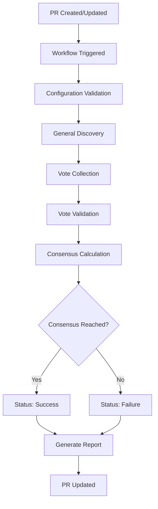

# 🏗️ LLM Consensus Gate - Architecture Overview

## 📋 Table of Contents
- [System Overview](#system-overview)
- [Core Components](#core-components)
- [Data Flow](#data-flow)
- [Security Model](#security-model)
- [Scalability Considerations](#scalability-considerations)
- [Future Enhancements](#future-enhancements)

## 🎯 System Overview

The LLM Consensus Gate is a distributed decision-making system that orchestrates multiple AI agents (LLMs) to collaboratively review and approve code changes through automated voting on GitHub pull requests.

### Key Characteristics
- **Distributed**: Multiple independent AI agents participate
- **Automated**: No human intervention required for consensus
- **Configurable**: Thresholds and rules can be customized
- **Transparent**: All votes and reasoning are publicly visible
- **GitHub Native**: Integrates seamlessly with GitHub workflows

## 🏛️ Core Components

### 1. Consensus Engine
**Location**: `.github/workflows/consensus.yml`
**Purpose**: Orchestrates the entire consensus process
**Technology**: GitHub Actions with JavaScript

#### Responsibilities
- Validates configuration files
- Collects votes from all generals
- Calculates consensus metrics
- Generates detailed reports
- Makes final pass/fail decision

### 2. Generals (AI Agents)
**Location**: `.consensus/generals.txt`
**Purpose**: Individual AI agents that provide votes
**Technology**: Various LLM APIs (OpenAI, Anthropic, etc.)

#### Characteristics
- Independent decision-making
- Specialized capabilities (security, performance, documentation)
- Configurable voting behavior
- Transparent reasoning process

### 3. Configuration System
**Location**: `.consensus/config.json`
**Purpose**: Central configuration management
**Technology**: JSON configuration files

#### Configuration Areas
- Consensus thresholds and rules
- Voting format and validation
- Notification preferences
- Workflow triggers and branches

### 4. Reporting System
**Location**: Built into workflow
**Purpose**: Provides detailed feedback and analytics
**Technology**: GitHub Job Summaries and PR comments

#### Report Components
- Consensus metrics dashboard
- Individual vote breakdown
- Recommendations and insights
- Historical performance data

## 🔄 Data Flow



### Detailed Flow

#### 1. Trigger Phase
- PR opened, edited, or synchronized
- Label added/removed (core, hotfix, etc.)
- Workflow automatically triggered

#### 2. Validation Phase
```javascript
// Validate configuration
if (!fs.existsSync('.consensus/generals.txt')) {
    core.setFailed('Missing generals configuration');
    return;
}

// Validate generals
const generals = loadGenerals();
if (generals.length < requiredMinimum) {
    core.setFailed('Insufficient generals configured');
    return;
}
```

#### 3. Collection Phase
```javascript
// Collect all comments from PR
const comments = await github.paginate(
    github.rest.issues.listComments,
    { owner, repo, issue_number: prNumber }
);

// Filter and parse votes
const votes = comments
    .filter(comment => isFromGeneral(comment))
    .map(comment => parseVote(comment))
    .filter(vote => vote.isValid);
```

#### 4. Calculation Phase
```javascript
// Calculate consensus metrics
const totalGenerals = generals.length;
const approvals = votes.filter(v => v.decision === 'approve').length;
const ratio = approvals / totalGenerals;

// Apply threshold based on labels
const threshold = hasCoreLabel ? 0.8 : 0.6;
const passed = ratio >= threshold;
```

#### 5. Reporting Phase
- Generate detailed workflow summary
- Create PR comment with results
- Set workflow outputs for other jobs
- Log metrics for monitoring

## 🔒 Security Model

### Threat Model
1. **Configuration Tampering**: Unauthorized changes to config files
2. **Vote Manipulation**: Fake votes from non-general accounts
3. **Information Disclosure**: Sensitive data in logs/comments
4. **Denial of Service**: Overwhelming the system with requests

### Security Controls

#### Access Control
```json
{
  "permissions": {
    "contents": "read",
    "pull-requests": "read",
    "issues": "read"
  }
}
```
- Read-only access to repository contents
- No write permissions to code
- Controlled access to PR and issue data

#### Input Validation
- Strict validation of vote format
- Sanitization of user inputs
- Rate limiting and timeout controls
- Authentication verification for generals

#### Audit Trail
- Complete logging of all actions
- Immutable record of votes and decisions
- Timestamp verification for all events
- Hash verification for configuration files

### Trust Model
- **Generals**: Trusted AI agents with verified identities
- **Configuration**: Version controlled and reviewable
- **Workflows**: Executed in isolated GitHub runners
- **Reports**: Publicly visible and verifiable

## 📈 Scalability Considerations

### Current Limitations
- Maximum 100 comments per PR (GitHub API limit)
- Workflow timeout (6 hours default)
- Rate limits on GitHub API calls
- Memory constraints in GitHub runners

### Scaling Strategies

#### Horizontal Scaling
```yaml
jobs:
  consensus:
    strategy:
      matrix:
        general-group: [security, performance, quality]
    steps:
      - name: Collect votes from ${{ matrix.general-group }}
        # Process subset of generals in parallel
```

#### Caching Layer
- Cache general configurations
- Store historical voting data
- Implement result memoization
- Use external databases for large datasets

#### Asynchronous Processing
```javascript
// Queue-based vote collection
const voteQueue = new Queue();
votes.forEach(vote => voteQueue.add(vote));

// Process votes asynchronously
await Promise.all(voteQueue.processAll());
```

## 🔮 Future Enhancements

### Phase 1: Core Improvements
- [ ] **Weighted Voting**: Different influence levels for generals
- [ ] **Confidence Scoring**: Quality-based vote weighting
- [ ] **Historical Analysis**: Learning from past decisions
- [ ] **Real-time Updates**: WebSocket-based live updates

### Phase 2: Advanced Features
- [ ] **Conflict Resolution**: AI-mediated dispute resolution
- [ ] **Multi-repository Coordination**: Cross-repo consensus
- [ ] **Predictive Analytics**: ML-based decision prediction
- [ ] **Integration APIs**: REST/webhook interfaces

### Phase 3: Enterprise Features
- [ ] **Audit Compliance**: SOC2/ISO27001 compliance
- [ ] **Advanced Security**: Zero-trust architecture
- [ ] **Global Distribution**: Multi-region deployment
- [ ] **Custom Models**: Organization-specific AI agents

## 📊 Performance Metrics

### Current Benchmarks
- **Vote Collection**: < 30 seconds for 50 comments
- **Consensus Calculation**: < 5 seconds
- **Report Generation**: < 10 seconds
- **Total Workflow Time**: 1-3 minutes

### Monitoring Points
- Consensus success rate
- Average response time per general
- Vote validation failure rate
- Configuration validation time
- Memory and CPU usage patterns

## 🔧 Operational Runbook

### Daily Operations
1. Monitor workflow success rates
2. Review failed consensus attempts
3. Update general configurations as needed
4. Analyze voting patterns and trends

### Incident Response
1. Identify root cause (configuration, network, API issues)
2. Implement temporary workarounds if needed
3. Update documentation with lessons learned
4. Improve monitoring and alerting

### Maintenance Tasks
- Regular security audits
- Performance optimization
- Dependency updates
- Configuration backups

## 📚 Related Documentation

- [Main README](../README.md) - User-facing documentation
- [Configuration Guide](.consensus/README.md) - Detailed configuration options
- [Troubleshooting](../README.md#troubleshooting) - Common issues and solutions
- [Contributing](../README.md#contributing) - Development guidelines

---

**Last Updated**: $(date)
**Version**: 1.0.0
**Authors**: LLM Consensus Gate Team
