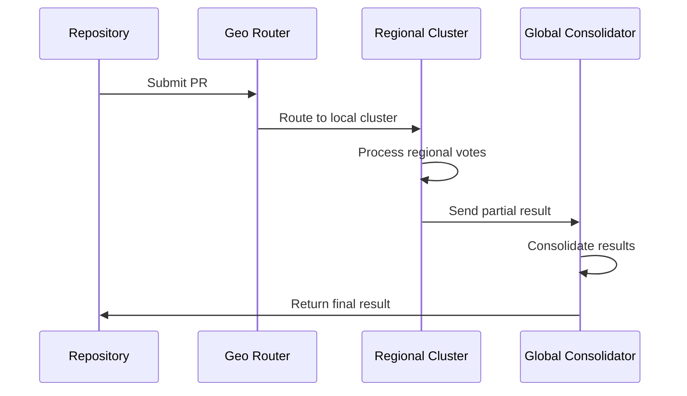

# 🌐 Federated Architecture for Global Consensus

## Overview
This document describes the federated architecture for global scalability of the consensus system.

## Core Components
1. **Regional Clusters**
   - Autonomous vote processing units
   - Strategically located in different geographical regions
   - Responsible for 80% of local processing

2. **Global Consolidator**
   - Orchestrates results between clusters
   - Maintains trans-regional consistency
   - Implements RAFT protocol for inter-cluster consensus

3. **Geo-Aware Router**
   - Directs requests to the nearest cluster
   - Latency-based load balancing
   - Automatic failover between regions

## Data Flow

## Technical Specifications
| Parameter | Target Value |
|-----------|------------|
| Max Latency | <500ms |
| Throughput | 1,000 PRs/min |
| Availability | 99.999% |
| Supported Regions | 6 continents |

## Deployment Plan
1. **Phase 1**: Deployment in 2 regions (EU and US)
2. **Phase 2**: Expansion to APAC and South America
3. **Phase 3**: Global coverage with 6 clusters