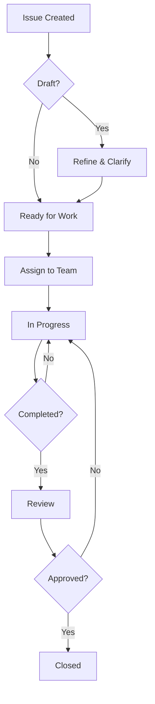

# 📋 **CMMV-Hive Issues System**

## 📋 **Overview**

This directory contains the issue tracking system for the CMMV-Hive project. Issues are used to track bugs, feature requests, improvements, discussions, and any other project-related tasks.

## 📁 **Directory Structure**

```
issues/
├── README.md                    # This file
├── template.md                  # Issue template
├── open/                        # Active issues
├── closed/                      # Completed/resolved issues
├── backlog/                     # Future considerations
└── templates/                   # Issue type templates
    ├── bug-report.md
    ├── feature-request.md
    ├── discussion.md
    ├── improvement.md
    └── maintenance.md
```

## 🏷️ **Issue Types**

### **🐛 Bug Report**
- Use for: Software bugs, errors, unexpected behavior
- Template: `templates/bug-report.md`
- Priority: High for critical bugs

### **✨ Feature Request**
- Use for: New features, enhancements, capabilities
- Template: `templates/feature-request.md`
- Priority: Medium to High based on impact

### **💬 Discussion**
- Use for: Open discussions, brainstorming, design decisions
- Template: `templates/discussion.md`
- Priority: Low to Medium

### **🔧 Improvement**
- Use for: Code improvements, refactoring, optimizations
- Template: `templates/improvement.md`
- Priority: Medium

### **🛠️ Maintenance**
- Use for: Documentation updates, dependency updates, cleanup
- Template: `templates/maintenance.md`
- Priority: Low

## 📝 **Issue Format**

### **File Naming Convention**
```
ISSUEXXX-description-of-issue.md
```

Where:
- `XXX` = Issue number (001, 002, 003, etc.)
- Description should be concise but descriptive

### **Example:**
```
ISSUE001-implement-user-authentication.md
ISSUE002-fix-voting-validation-bug.md
ISSUE003-add-dark-mode-support.md
```

## 📋 **Issue Status Workflow**

### **📂 Open Issues (`issues/open/`)**
1. **Draft**: Initial creation, needs refinement
2. **Ready**: Ready for work, assigned to team
3. **In Progress**: Actively being worked on
4. **Review**: Completed, waiting for review
5. **Blocked**: Cannot proceed due to dependencies

### **📂 Closed Issues (`issues/closed/`)**
1. **Completed**: Successfully implemented
2. **Duplicate**: Already exists elsewhere
3. **Won't Fix**: Decided not to implement
4. **Invalid**: Not a valid issue
5. **Cancelled**: No longer needed

### **📂 Backlog (`issues/backlog/`)**
1. **Future**: Good idea, but not immediate priority
2. **Research**: Needs more investigation
3. **Epic**: Large feature requiring breakdown

## 🏷️ **Issue Labels**

### **Priority Labels:**
- 🔥 **Critical**: System breaking, security issues
- 🔴 **High**: Important features, major bugs
- 🟡 **Medium**: Nice-to-have features, minor bugs
- 🔵 **Low**: Future improvements, documentation

### **Category Labels:**
- 🏗️ **Architecture**: System design, infrastructure
- 🔧 **Development**: Code changes, technical tasks
- 📚 **Documentation**: Guides, README updates
- 🧪 **Testing**: Test creation, QA tasks
- 🔒 **Security**: Security improvements, audits
- ⚡ **Performance**: Optimization tasks
- 🎨 **UI/UX**: Interface improvements
- 🤖 **AI/ML**: AI model related tasks

### **Team Labels:**
- 🔒 **Security Team**
- ⚡ **Performance Team**
- 🧪 **Testing Team**
- 📚 **Documentation Team**
- 🤖 **Core Infrastructure Team**
- 🔧 **Dev Tools Team**
- 📊 **Data Team**
- 🏛️ **Governance Team**

## 📝 **Creating an Issue**

### **Step 1: Choose Template**
Select the appropriate template from `issues/templates/` based on your issue type.

### **Step 2: Fill Template**
Complete all required sections of the template with detailed information.

### **Step 3: File Location**
- **New Issues**: Place in `issues/open/`
- **Use correct naming**: `ISSUEXXX-description.md`

### **Step 4: Assignment**
- Assign to appropriate team based on `teams/TEAMS.md`
- Add relevant labels
- Set priority level

## 🔄 **Issue Lifecycle**



## 📊 **Issue Metrics**

### **Dashboard Metrics:**
- Total open issues
- Issues by priority
- Issues by team
- Average resolution time
- Issue aging report

### **Quality Metrics:**
- Issues with complete information
- Issues properly labeled
- Issues with clear acceptance criteria
- Issues with assigned owners

## 🎯 **Best Practices**

### **Writing Good Issues:**
1. **Clear Title**: Describe the issue concisely
2. **Detailed Description**: Explain the problem or request
3. **Acceptance Criteria**: Define when the issue is complete
4. **Reproduction Steps**: For bugs, provide clear steps
5. **Expected Behavior**: Describe desired outcome
6. **Impact Assessment**: Explain why this matters

### **Issue Management:**
1. **Regular Review**: Weekly issue triage meetings
2. **Status Updates**: Keep issues current
3. **Dependencies**: Link related issues
4. **Documentation**: Update docs as issues are resolved

## 🔗 **Integration Points**

### **Related Systems:**
- **Proposals**: `proposals/` directory for formal proposals
- **Teams**: `teams/TEAMS.md` for team assignments
- **Minutes**: `minutes/` for meeting records
- **Status**: `proposals/STATUS.md` for proposal tracking

### **CI/CD Integration:**
- Issues can trigger automated workflows
- Status updates can be automated
- Metrics can be collected automatically

## 📞 **Support**

### **Getting Help:**
- Check existing issues before creating new ones
- Use templates to ensure complete information
- Tag appropriate team leads for questions
- Review contributing guidelines

### **Escalation:**
- Priority issues: Contact team lead immediately
- Blocked issues: Escalate to project coordinator
- Cross-team issues: Bring to weekly coordination meeting

---

## 📋 **Quick Start**

1. **New Issue**: Copy template from `issues/templates/`
2. **Fill Details**: Complete all required sections
3. **Choose Location**: Place in appropriate status folder
4. **Assign Team**: Tag relevant team based on `teams/TEAMS.md`
5. **Add Labels**: Include priority and category labels

---

**System Version**: 1.0
**Last Updated**: 2025-01-21
**Maintained By**: Project Coordination Team
