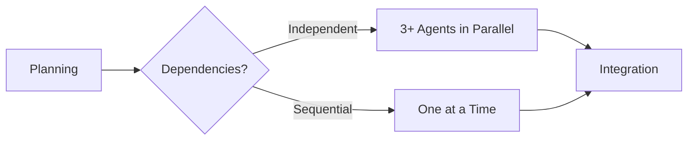

# AI Integration Manual - Quick Reference

**Version**: 1.1.0 | **Last Updated**: 2025-10-11

This is a condensed reference guide for AI agents. For complete details, see `AI_INTEGRATION_MANUAL_TEMPLATE.md`.

---

## 🚀 Quick Start

### New Project Checklist

```bash
# 1. Create documentation structure
mkdir -p docs/specs docs/reviews docs/versions docs/api docs/user-guide
mkdir -p tests/unit tests/integration tests/e2e tests/fixtures tests/helpers
mkdir -p scripts config

# 2. Create essential files
touch docs/ROADMAP.md docs/SPECS.md CHANGELOG.md .cursorrules

# 3. Initialize git
git init
git checkout -b develop

# 4. Start implementation
# Follow the manual's Phase 1-6 process
```

---

## 📊 Project Lifecycle (6 Phases)

```
1. PLANNING (10-20%)       → Create docs, ROADMAP, SPECS
2. WORKSPACE (5-10%)       → Setup testing, CI/CD, git
3. IMPLEMENTATION (50-60%) → Code, test, review (PARALLELIZABLE)
4. FINAL REVIEW (10-15%)   → Multi-agent review, judge decision
5. HUMAN APPROVAL (5-10%)  → User docs, API docs, release
6. CONTINUOUS (Ongoing)    → Monitor issues, maintain
```

---

## ✅ Pre-Commit Checklist

- [ ] All tests pass (`npm test`)
- [ ] No linter errors (`npm run lint`)
- [ ] Code formatted
- [ ] Coverage > 90%
- [ ] Documentation updated
- [ ] ROADMAP status updated
- [ ] CHANGELOG updated (if user-facing)
- [ ] No secrets or credentials
- [ ] No debug code
- [ ] Ethics checklist passed

---

## 🎯 Performance Targets (KPIs)

| Metric | Target |
|--------|--------|
| **Time to First Commit** | < 2 hours |
| **Test Coverage** | > 90% |
| **First-Time Approval Rate** | > 95% |
| **Build Success Rate** | > 98% |
| **Review Turnaround** | < 48 hours |
| **Bug Escape Rate** | < 5% |
| **Context Window Usage** | < 80% |

---

## 🔧 Common Commands

```bash
# Testing
npm test                           # Run all tests
npm test -- --coverage             # With coverage
npm test -- --verbose              # Verbose output
npm test -- path/to/test.spec.ts  # Single file

# Linting
npm run lint                       # Check issues
npm run lint -- --fix              # Auto-fix

# Building
npm run build                      # Build project
npm run build -- --verbose         # With output

# Git Workflow
git checkout -b feature/[name]     # Create feature branch
git add .                          # Stage changes
git commit -m "feat: description"  # Commit
git push origin feature/[name]     # Push to remote

# Task Queue
task-queue update --task TASK-123 --status IN_PROGRESS
task-queue show TASK-123 --dependencies

# Vectorizer
vectorizer search --collection project --query "how to..."
vectorizer upload --collection project-docs --path ./docs
```

---

## 📝 Commit Message Format

```
[type]([scope]): [description]

[optional body]

[TASK-XXX]
[Closes #issue]
```

**Types**: `feat`, `fix`, `docs`, `style`, `refactor`, `perf`, `test`, `chore`

**Examples**:
```
feat(api): add user authentication endpoint
fix(db): resolve connection pool leak
docs: update installation instructions
test: add edge cases for validation
```

---

## 🔍 Troubleshooting Quick Fixes

### Test Failures
```bash
npm test -- --verbose              # See details
npm test -- -u                     # Update snapshots
rm -rf node_modules && npm install # Reinstall deps
```

### Build Errors
```bash
rm -rf dist/ build/ .cache/        # Clear cache
npm run lint                       # Check syntax
tsc --noEmit                       # Check types
```

### Merge Conflicts
```bash
git fetch origin
git merge origin/develop
# Resolve conflicts in editor
git add .
git commit -m "chore: resolve merge conflicts"
```

### Linter Errors
```bash
npm run lint -- --fix              # Auto-fix
```

---

## 🛡️ Ethics Quick Check

Before committing, verify:

- [ ] No hardcoded secrets (API keys, passwords)
- [ ] No PII or sensitive data
- [ ] No biased assumptions (gender, race, etc.)
- [ ] Privacy-preserving design
- [ ] Accessible to all users
- [ ] Efficient resource usage
- [ ] Clear audit trail
- [ ] License compliance checked
- [ ] No harmful functionality
- [ ] Error messages don't leak data

---

## 🚨 When to Escalate to Human

1. **Critical security issues** - Potential data breach
2. **Unresolvable conflicts** - Multiple agents disagree
3. **Persistent failures** - Same test fails 3+ times
4. **Architectural decisions** - Major design changes
5. **Resource limits** - Budget/quota exceeded
6. **Ethical concerns** - Request violates guidelines

**Escalation Template**: Create issue with:
- Severity level
- Problem description
- What was tried
- Impact analysis
- Recommendation

---

## 📁 Directory Structure

```
project-root/
├── .github/
│   └── workflows/          # CI/CD
├── docs/
│   ├── ROADMAP.md          # Project plan
│   ├── SPECS.md            # Feature summary
│   ├── specs/              # Detailed specs
│   ├── reviews/            # Review reports
│   ├── api/                # API docs
│   └── user-guide/         # End-user docs
├── src/                    # Source code
├── tests/                  # All tests
│   ├── unit/
│   ├── integration/
│   └── e2e/
├── scripts/                # Build scripts
├── config/                 # Configuration
├── .cursorrules            # AI rules
├── .gitignore
├── README.md
├── CHANGELOG.md
└── LICENSE
```

---

## 🔄 Task Queue States

```
PENDING → IN_PROGRESS → REVIEW → [REVISION →] COMPLETED
                              ↓
                          BLOCKED / CANCELLED
```

**Update at**:
- Task start: `PENDING` → `IN_PROGRESS`
- Code complete: `IN_PROGRESS` → `REVIEW`
- Review feedback: `REVIEW` → `REVISION`
- Re-submission: `REVISION` → `REVIEW`
- Approval: `REVIEW` → `COMPLETED`

---

## 🎨 Code Quality Standards

### Test Coverage
- **Minimum Overall**: 90%
- **Critical Paths**: 100%
- **Unit Tests**: 95%
- **Integration Tests**: 85%

### Code Organization
- One feature per file/module
- Clear separation of concerns
- DRY (Don't Repeat Yourself)
- SOLID principles
- Meaningful names (no `temp`, `data`, `foo`)

### Documentation
- All public APIs have JSDoc/docstrings
- Complex logic has inline comments explaining WHY
- README with setup instructions
- CHANGELOG with user-facing changes

---

## 🔁 Parallel Implementation

For large projects with independent features:



**Coordinate**:
- Use feature branches
- Merge develop daily
- Update Task Queue dependencies
- Communicate in Slack/Discord
- Resolve conflicts promptly

---

## 🤖 Automation Triggers

### GitHub Actions
- **On Push**: Lint, test, build
- **On PR**: Security scan, auto-review, coverage check
- **On Merge**: Deploy, update Vectorizer, notify team
- **Scheduled**: Dependency updates, doc sync

### Webhooks
- **Task Queue**: Auto-update on commit/PR
- **Metrics**: Record on task completion
- **Notifications**: Slack/Discord on events

---

## 📈 Weekly Reporting

Generate weekly reports with:

```markdown
## Speed Metrics
- ⚡ Avg Task Completion: [X] min
- ⏱️ Lead Time: [X] days
- 🚀 Daily Commits: [X]

## Quality Metrics
- ✅ Test Coverage: [X]%
- 🐛 Bug Escape Rate: [X]%
- 📝 Documentation: [X]%

## Reliability Metrics
- ✔️ Test Pass Rate: [X]%
- 🏗️ Build Success: [X]%
- 🔄 Rollback Rate: [X]%

## Trends
- [Improving/Stable/Declining areas]

## Action Items
- [ ] [Actions needed]
```

---

## 🔗 Integration Points

### Task Queue
```bash
task-queue update --project [id] --status [status]
task-queue show [task-id] --dependencies
```

### Vectorizer
```bash
vectorizer search --collection [name] --query "[q]"
vectorizer upload --collection [name] --path [path]
```

### GitHub CLI
```bash
gh pr create --title "[title]" --body "[body]"
gh release create v[version] --notes "[notes]"
```

---

## 💡 Best Practices

### Do's ✅
- Break tasks into < 30 min units
- Write tests before/alongside code
- Update ROADMAP immediately
- Commit frequently with clear messages
- Request review when done
- Document decisions (ADRs)
- Search Vectorizer first
- Follow ethics guidelines
- Track metrics
- Automate repetitive tasks

### Don'ts ❌
- Don't commit secrets
- Don't skip tests
- Don't ignore linter errors
- Don't commit directly to main
- Don't implement without specs
- Don't merge with conflicts
- Don't bypass review
- Don't violate ethics
- Don't ignore metrics
- Don't duplicate code

---

## 📞 Support & Resources

- **Full Manual**: `AI_INTEGRATION_MANUAL_TEMPLATE.md`
- **Language Guides**: `[language]/AI_INTEGRATION_MANUAL_[LANGUAGE].md`
- **Issues**: Create in governance repo with `manual` tag
- **Questions**: Search Vectorizer first, then ask in Slack
- **Updates**: Watch governance repo for announcements

---

## 🎓 Learning Path

1. **Day 1**: Read full manual, understand lifecycle
2. **Day 2**: Practice with small project (< 5 features)
3. **Day 3**: Review ethics guidelines, practice troubleshooting
4. **Day 4**: Set up automation (CI/CD, webhooks)
5. **Week 2**: Participate in multi-agent project
6. **Ongoing**: Track metrics, improve continuously

---

## 📊 Success Metrics

You're doing well if:
- ✅ Tasks complete within estimated time
- ✅ First-time approval rate > 95%
- ✅ Test coverage consistently > 90%
- ✅ Build success rate > 98%
- ✅ No ethics violations
- ✅ Positive peer reviews
- ✅ Minimal escalations
- ✅ Clear documentation
- ✅ Efficient resource usage
- ✅ Contributing to team metrics

---

**Quick Reference v1.1.0** | For complete details, see the full manual  
**Maintained by**: HiveLLM Governance Team | **License**: MIT

