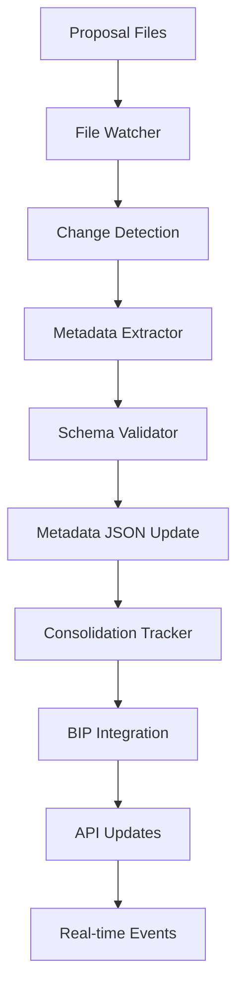

# 🔄 Metadata Migration & Synchronization System

**Version**: 1.0  
**Created**: 2025-09-18  
**Purpose**: Automated synchronization between proposal files and structured metadata  
**Coverage**: 57 proposals across all categories and statuses  

## 📊 **Migration Overview**

### **Current State**
- **✅ 57 JSON metadata files** created in `/gov/proposals/metadata/`
- **✅ Schema compliance** with `proposal.schema.json`
- **✅ Consolidation tracking** implemented
- **✅ BIP integration** active for 5 BIPs

### **Migration Goals**
1. **Bidirectional Sync**: Keep proposal files and metadata in sync
2. **Automated Updates**: Real-time metadata updates on file changes
3. **Validation Pipeline**: Ensure data integrity across all systems
4. **API Integration**: Enable real-time governance queries

## 🔧 **Migration Architecture**

```typescript
interface MigrationSystem {
  // Core Components
  fileWatcher: ProposalFileWatcher;
  metadataSync: MetadataSync;
  schemaValidator: SchemaValidator;
  consolidationTracker: ConsolidationTracker;
  
  // API Integration
  governanceAPI: GovernanceAPI;
  bipIntegration: BIPIntegration;
  realTimeUpdates: EventEmitter;
}
```

### **Data Flow**


## 📋 **Migration Procedures**

### **1. Manual Validation Steps**
**Validate JSON Structure:**
```bash
# Navigate to metadata directory
cd gov/proposals/metadata

# Validate all JSON files
for file in *.json; do
    jq -e . "$file" > /dev/null && echo "✅ Valid: $file" || echo "❌ Invalid: $file"
done
```

**Schema Compliance Check:**
```bash
# If ajv-cli is available
ajv validate -s ../schemas/proposal.schema.json -d "*.json"

# Alternative: Basic structure validation
jq '.id, .title, .status, .category' *.json > /dev/null
```

**Generate Consolidation Summary:**
```bash
# Create consolidation mapping
jq -s 'map(select(.metadata.consolidation.isConsolidated == true)) | group_by(.metadata.consolidation.consolidatedInto)' *.json > ../consolidation-map.json
```

### **2. Sync Validation Script**
```typescript
// validate-sync.ts
interface SyncValidation {
  fileProposal: ProposalFile;
  jsonMetadata: ProposalMetadata;
  syncStatus: 'synced' | 'outdated' | 'missing' | 'conflict';
}

async function validateSync(): Promise<SyncValidation[]> {
  const results: SyncValidation[] = [];
  
  // Check all proposal files
  const proposalFiles = await glob('gov/proposals/**/*.md');
  
  for (const file of proposalFiles) {
    const proposalId = extractProposalId(file);
    const metadataFile = `gov/proposals/metadata/${proposalId}-*.json`;
    
    if (await exists(metadataFile)) {
      const fileContent = await readProposalFile(file);
      const metadata = await readMetadataFile(metadataFile);
      
      results.push({
        fileProposal: fileContent,
        jsonMetadata: metadata,
        syncStatus: compareSyncStatus(fileContent, metadata)
      });
    } else {
      results.push({
        fileProposal: await readProposalFile(file),
        jsonMetadata: null,
        syncStatus: 'missing'
      });
    }
  }
  
  return results;
}
```

### **3. Synchronization Guidelines**

**Manual Sync Process:**
1. **Identify Changes**: Monitor proposal file modifications
2. **Extract Metadata**: Parse updated proposal headers and content  
3. **Update JSON**: Modify corresponding metadata files
4. **Validate Schema**: Ensure compliance with `proposal.schema.json`
5. **Update References**: Maintain cross-reference integrity

**Key Sync Points:**
- **Title Changes**: Update `title` field in metadata
- **Status Updates**: Modify `status` and `updatedAt` fields  
- **Author Changes**: Update `proposer` information
- **Content Updates**: Refresh `abstract`, `motivation`, etc.
- **Consolidation Changes**: Update `metadata.consolidation` tracking

**Validation Checklist:**
- [ ] JSON structure valid (`jq` parse test)
- [ ] Schema compliance verified
- [ ] Cross-references intact
- [ ] Consolidation tracking updated
- [ ] BIP mapping current

## 🗂️ **Consolidation Migration**

### **Current Consolidation Status**
```json
{
  "consolidationTracks": [
    {
      "trackId": "001",
      "title": "Security & Integrity Suite",
      "proposals": ["024", "038", "036", "007", "052"],
      "status": "ready",
      "bipTarget": "BIP-07"
    },
    {
      "trackId": "002", 
      "title": "Quality, Testing & Validation",
      "proposals": ["022", "023", "034", "049"],
      "status": "ready",
      "bipTarget": "BIP-09"
    },
    {
      "trackId": "003",
      "title": "Governance Observability Platform", 
      "proposals": ["040", "041", "047", "057", "058", "056"],
      "status": "ready",
      "bipTarget": "BIP-08"
    },
    {
      "trackId": "006",
      "title": "Inter-Model Communication Suite",
      "proposals": ["054", "048", "043", "050"],
      "status": "active",
      "bipNumber": "BIP-05"
    }
  ]
}
```

### **Migration Commands**
```bash
# Generate consolidated metadata
cd gov/proposals/metadata
jq -s 'group_by(.metadata.consolidation.consolidatedInto) | map({track: .[0].metadata.consolidation.consolidatedInto, count: length, proposals: map({id, title, proposer: .proposer.model})})' *.json > ../consolidated-summary.json

# Update consolidated files with metadata references
for track in $(jq -r '.[].track' ../consolidated-summary.json); do
    echo "Updating track: $track"
    # Update consolidated markdown files with metadata links
done

# Sync BIP implementations
jq -s 'map(select(.status == "active" or .status == "implemented")) | map({id, title, status, bip: .metadata.consolidation.bipNumber})' *.json > ../bip-status.json
```

## 📈 **Real-time Integration**

### **API Endpoints**
```typescript
// Migration API endpoints
app.get('/api/migration/status', getMigrationStatus);
app.post('/api/migration/sync', triggerFullSync);
app.get('/api/migration/validate', validateAllMetadata);

// Real-time endpoints  
app.get('/api/governance/proposals', getProposalMetadata);
app.get('/api/governance/consolidated', getConsolidatedTracks);
app.get('/api/governance/bips', getActiveBIPs);
app.post('/api/governance/proposals/:id/update', updateProposalMetadata);
```

### **Event Stream**
```typescript
interface GovernanceEvent {
  type: 'proposal.updated' | 'consolidation.changed' | 'bip.status' | 'metadata.synced';
  timestamp: string;
  data: any;
}

// WebSocket events for real-time updates
io.on('connection', (socket) => {
  socket.join('governance-updates');
  
  // Send current state
  socket.emit('initial-state', {
    proposals: await getProposalMetadata(),
    consolidated: await getConsolidatedTracks(),
    bips: await getActiveBIPs()
  });
});
```

## 🎯 **Migration Checklist**

### **Phase 1: Validation** ✅ Complete
- [x] All 57 JSON files created
- [x] Schema compliance verified
- [x] Consolidation tracking implemented
- [x] BIP integration active

### **Phase 2: Automation** 🔄 Active
- [ ] File watcher implementation
- [ ] Auto-sync scripts deployment
- [ ] Real-time API activation
- [ ] Event system integration

### **Phase 3: Integration** 📋 Planned
- [ ] BIP-06 autonomous capabilities
- [ ] Cursor extension integration
- [ ] Dashboard real-time updates
- [ ] Cross-system synchronization

## 🔧 **Validation Commands**

**Basic Validation:**
```bash
# JSON structure validation
cd gov/proposals/metadata && find . -name "*.json" -exec jq -e . {} \;

# Count validation
echo "Expected: 57 files, Actual: $(ls *.json | wc -l)"

# Schema validation (if ajv available)
ajv validate -s ../schemas/proposal.schema.json -d "*.json"
```

**Completeness Check:**
```bash
# Verify all categories represented
jq -r '.category' *.json | sort | uniq -c

# Check consolidation integrity  
jq -r 'select(.metadata.consolidation.isConsolidated == true) | .metadata.consolidation.consolidatedInto' *.json | sort | uniq -c

# BIP mapping verification
jq -r 'select(.metadata.consolidation.bipNumber != null) | .metadata.consolidation.bipNumber' *.json | sort
```

---

**Migration Status**: ✅ **Metadata Complete** | 🔄 **Sync Development** | 🎯 **Real-time Integration Target**
